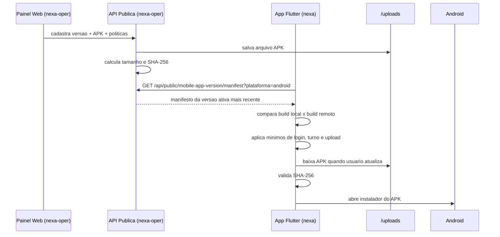

# Auto-update e politica de versao do Nexa Mobile

Este guia descreve como o processo de validacao de versao e atualizacao automatica funciona entre os dois projetos:

- `nexa-oper`: monorepo da API, painel web e banco.
- `nexa`: app Flutter que consome a API e instala o APK.

O objetivo do fluxo e permitir publicar uma nova versao Android do app, definir builds minimos por operacao e garantir que o APK baixado pelo app seja o mesmo arquivo publicado pela operacao.

## Visao geral



## Conceitos principais

### Build

O app decide atualizacao por `build`, nao pelo texto da versao.

No Flutter, a versao local vem do `pubspec.yaml`:

```yaml
version: 1.1.2+112
```

Neste exemplo:

- `1.1.2` e a versao exibida.
- `112` e o build usado para comparacao.

Na API/painel, o campo `build` da versao publicada precisa ser maior que o build instalado no aparelho para o app oferecer update.

### Politicas de build minimo

Cada versao publicada pode definir:

| Campo | Efeito no app |
| --- | --- |
| `minSupportedBuild` / `minSupported` | Build minimo global. Abaixo dele, o app considera a versao local obrigatoriamente desatualizada. |
| `minLoginBuild` | Build minimo para permitir login. |
| `minOpenTurnoBuild` | Build minimo para permitir abertura de turno. |
| `minUploadBuild` | Build minimo para permitir uploads/sync de pendencias. |

Quando uma politica especifica e menor que `minSupportedBuild`, prevalece o maior valor. Ou seja, `minSupportedBuild` e o piso global.

### Wipe

O campo `wipeRequired` indica que a nova build deve limpar dados locais no primeiro boot depois da instalacao.

O app nao apaga dados antes de instalar. Ele grava uma flag local `pendingWipeForBuild` e executa o wipe no splash da nova build, evitando perda de dados se o usuario cancelar a instalacao.

### SHA-256

A API calcula o `sha256` do APK publicado.

Depois do download, o app calcula o SHA-256 do arquivo baixado. Se o hash for diferente:

1. o APK baixado e apagado;
2. a instalacao e cancelada;
3. o usuario recebe erro de arquivo invalido.

Se o manifesto nao trouxer `sha256`, o app mantem compatibilidade e segue, mas registra aviso em log.

## Como funciona no nexa-oper

### Banco de dados

Modelo Prisma:

`packages/db/prisma/models/mobile-app-version.prisma`

Campos relevantes:

| Campo | Descricao |
| --- | --- |
| `versao` | Versao exibida no app, exemplo `1.2.0`. |
| `build` | Build numerico usado para comparacao. |
| `plataforma` | Plataforma da versao, normalmente `android` ou `ios`. |
| `ativo` | Define se a versao pode ser publicada no manifesto. |
| `urlDownload` | URL de download informada ou derivada. |
| `arquivoPath` | Caminho do arquivo salvo no storage local. |
| `apkSizeBytes` | Tamanho do APK em bytes. |
| `sha256` | Hash SHA-256 do APK. |
| `wipeRequired` | Agenda wipe local apos instalacao. |
| `minSupportedBuild` | Build minimo global. |
| `minLoginBuild` | Build minimo para login. |
| `minOpenTurnoBuild` | Build minimo para abrir turno. |
| `minUploadBuild` | Build minimo para upload/sync. |

Quando alterar esse modelo, rode:

```bash
npm run generate --workspace @nexa-oper/db
npm run type-check --workspace nexa-api
```

Em ambiente de producao, a migration precisa ser aplicada antes de publicar versoes que dependem desses campos.

### Painel web

Tela principal:

`apps/web/src/ui/pages/dashboard/cadastro/mobile-app-version/MobileAppVersionPageClient.tsx`

Rota usada pelo painel:

`apps/web/src/app/api/mobile-app-version/route.ts`

O painel permite cadastrar:

- versao;
- build;
- plataforma;
- APK;
- flag de ativo;
- observacoes;
- `wipeRequired`;
- builds minimos de politica.

Ao receber o APK, a rota do web:

1. salva o arquivo;
2. calcula tamanho;
3. calcula SHA-256;
4. grava metadados e politicas no banco.

### API administrativa

Modulo:

`apps/api/src/modules/mobile-app-version`

Pontos principais:

| Arquivo | Responsabilidade |
| --- | --- |
| `mobile-app-version.service.ts` | Cria versoes, calcula hash/tamanho e monta manifesto publico. |
| `mobile-app-version-public.controller.ts` | Expoe endpoints publicos usados pelo app. |
| `dto/mobile-app-version.dto.ts` | Contrato de entrada e saida administrativo. |
| `mobile-app-version.service.spec.ts` | Testes do contrato do manifesto. |

### Manifesto publico oficial

Endpoint:

```http
GET /api/public/mobile-app-version/manifest?plataforma=android
```

Resposta sem envelope:

```json
{
  "latest": "1.2.0",
  "build": 120,
  "apkUrl": "/uploads/mobile-app-version/nexa-1.2.0.apk",
  "minSupported": 110,
  "wipeRequired": false,
  "notes": "Correcoes e melhorias.",
  "apkSizeBytes": 73400320,
  "sha256": "e73975ed917ecd161b0495eb8d186c8ee93ccc33caf99dbc9e8c4e829a84870d",
  "policy": {
    "minLoginBuild": 110,
    "minOpenTurnoBuild": 115,
    "minUploadBuild": 118
  }
}
```

Regras do manifesto:

- Busca apenas versao `ativo = true`.
- Filtra por plataforma.
- Ordena por maior `build`.
- Normaliza plataforma para `android` ou `ios`.
- Retorna `apkUrl` como cadastrado; pode ser absoluto ou relativo.

### Endpoint legado

O app ainda suporta fallback para manifesto estatico:

```http
GET {updatesBaseUrl}/nexa_app.json
```

Esse fallback existe para compatibilidade. O fluxo oficial deve ser o endpoint da API.

## Como funciona no nexa

### Arquivos principais

| Arquivo | Responsabilidade |
| --- | --- |
| `lib/core/update/update_service.dart` | Orquestra checagem, politica, download, validacao e instalacao. |
| `lib/core/update/update_manifest.dart` | Parseia o manifesto recebido da API ou do JSON legado. |
| `lib/core/update/update_policy_gate.dart` | Representa bloqueios por operacao: login, abrir turno e upload. |
| `lib/core/update/apk_integrity_validator.dart` | Calcula e valida SHA-256 do APK. |
| `lib/core/enums/update_policy_state.dart` | Estados gerais de update: opcional, obrigatorio, bloqueado por turno/fila. |

### Ordem de busca do manifesto

O app tenta nesta ordem:

1. API oficial:

```http
GET {ApiRuntimeConfigService.baseUrl}/public/mobile-app-version/manifest?plataforma=android
```

Se `baseUrl` for `https://api.exemplo.com/api`, a URL final sera:

```http
https://api.exemplo.com/api/public/mobile-app-version/manifest?plataforma=android
```

2. Manifesto estatico legado:

```http
GET {updatesBaseUrl}/nexa_app.json
```

3. Origem derivada da API, tambem em modo legado:

```http
GET {origemDaApi}/nexa_app.json
```

### URL do APK

O manifesto pode retornar `apkUrl` absoluto ou relativo.

Exemplos aceitos:

```json
{ "apkUrl": "https://api.exemplo.com/uploads/app.apk" }
```

```json
{ "apkUrl": "/uploads/app.apk" }
```

Quando a URL e relativa, o app resolve usando a URL do manifesto. Assim `/uploads/app.apk` vira `https://api.exemplo.com/uploads/app.apk`.

### Checagem de update

O app verifica update em pontos de entrada do fluxo:

| Local | Comportamento |
| --- | --- |
| Splash | Checa update e redireciona para tela bloqueante quando necessario. |
| Login | Checa update ao abrir a tela e antes de autenticar. |
| Home | Checa update e observa mudancas de estado. |
| Configuracoes da API | Permite verificacao manual e update administrativo. |

### Estados gerais

`UpdateService.evaluateUpdateState()` calcula:

| Estado | Condicao | Efeito |
| --- | --- | --- |
| `none` | Sem update ou build local maior/igual ao remoto. | Fluxo normal. |
| `optional` | Build remoto maior, mas build local ainda permitido. | Banner de atualizacao. |
| `required` | Build local abaixo do minimo global. | Bloqueio de uso normal. |
| `blockedByShift` | Update obrigatorio, mas existe turno aberto. | Usuario precisa fechar turno antes de atualizar. |
| `blockedByPendingSync` | Update obrigatorio, mas existem pendencias locais. | Usuario precisa sincronizar antes de atualizar. |

### Politicas granulares

`UpdateService.evaluatePolicyGate()` aplica as politicas por operacao.

#### Login

Arquivo:

`lib/presentation/modules/login/login_controller.dart`

Antes de chamar `AuthService.login`, o app avalia:

```dart
UpdatePolicyGate.login
```

Bloqueia se:

```text
buildLocal < max(minSupportedBuild, minLoginBuild)
```

#### Abertura de turno

Arquivo:

`lib/presentation/modules/turno/abrir/abrir_turno_controller.dart`

Antes de abrir turno, o app avalia:

```dart
UpdatePolicyGate.openTurno
```

Bloqueia se:

```text
buildLocal < max(minSupportedBuild, minOpenTurnoBuild)
```

#### Upload e sincronizacao de pendencias

Arquivo:

`lib/core/sync/sync_worker_service.dart`

Antes de processar fila, sync forcada, sync rapida ou garantia de sync de turno, o app avalia:

```dart
UpdatePolicyGate.upload
```

Bloqueia se:

```text
buildLocal < max(minSupportedBuild, minUploadBuild)
```

Quando bloqueia upload automatico, a fila permanece local e o worker agenda nova tentativa. Nenhum item e descartado.

### Processo de update no app

Quando o usuario toca em atualizar:

1. Confere permissao Android para instalar APK externo.
2. Bloqueia se houver turno aberto.
3. Bloqueia se houver pendencias locais.
4. Executa sincronizacao final ate esvaziar filas.
5. Confere espaco em disco usando `apkSizeBytes` ou `HEAD`.
6. Baixa o APK.
7. Valida SHA-256 se o manifesto trouxe `sha256`.
8. Agenda wipe se `wipeRequired = true`.
9. Abre o instalador Android via `OpenFilex`.

Se a validacao SHA-256 falhar, o app apaga o APK baixado e nao abre o instalador.

## Como configurar

### No nexa-oper

1. Aplicar migration do banco.
2. Gerar Prisma Client.
3. Subir API e web.
4. Garantir que uploads estejam servidos publicamente.
5. Cadastrar a versao pelo painel.

Comandos comuns:

```bash
npm run generate --workspace @nexa-oper/db
npm run type-check --workspace nexa-api
npm run type-check --workspace @nexa-oper/web
```

Em producao, a ordem recomendada e:

```bash
npm ci
npm run db:generate
npm run db:migrate:deploy
npm run build
```

### No nexa

1. Atualizar `pubspec.yaml` com versao e build novos.
2. Gerar APK release.
3. Publicar o APK pelo painel do `nexa-oper`.
4. Testar manifesto no aparelho.

Exemplo de versao:

```yaml
version: 1.2.0+120
```

O `+120` precisa coincidir com o `build` cadastrado no painel.

## Como publicar uma versao

### 1. Gerar o APK

No repo `nexa`:

```bash
flutter pub get
flutter build apk --release
```

O APK normalmente fica em:

```text
build/app/outputs/flutter-apk/app-release.apk
```

### 2. Cadastrar no painel

No `nexa-oper`, abrir a tela de cadastro de versao mobile e preencher:

| Campo | Exemplo |
| --- | --- |
| Plataforma | `android` |
| Versao | `1.2.0` |
| Build | `120` |
| APK | `app-release.apk` |
| Ativo | `true` |
| Wipe required | `false` |
| Min supported build | `112` |
| Min login build | `112` |
| Min open turno build | `115` |
| Min upload build | `118` |

### 3. Validar o manifesto

```bash
curl -s "https://api.seu-dominio.com/api/public/mobile-app-version/manifest?plataforma=android" | jq
```

Conferir:

- `build` maior que o build instalado no aparelho de teste.
- `apkUrl` acessivel.
- `apkSizeBytes` preenchido.
- `sha256` preenchido.
- `policy` com os minimos esperados.

### 4. Testar no app

No aparelho:

1. Abrir app com build antigo.
2. Verificar se aparece banner ou tela bloqueante.
3. Testar login conforme `minLoginBuild`.
4. Testar abertura de turno conforme `minOpenTurnoBuild`.
5. Testar upload/sync conforme `minUploadBuild`.
6. Acionar update.
7. Confirmar download, validacao e abertura do instalador.

## Estrategias de politica

### Update opcional

Use quando a versao antiga ainda pode operar:

```text
build = 120
minSupportedBuild = 100
minLoginBuild = null
minOpenTurnoBuild = null
minUploadBuild = null
```

Resultado: builds abaixo de `120` veem update disponivel, mas continuam usando o app se estiverem acima de `100`.

### Bloquear login

Use para forcar todos os usuarios abaixo de certo build a atualizar antes de autenticar:

```text
minLoginBuild = 120
```

### Bloquear abertura de turno

Use quando a versao antiga pode consultar dados, mas nao deve iniciar trabalho novo:

```text
minOpenTurnoBuild = 120
```

### Bloquear upload

Use quando a API mudou contrato de upload e builds antigos nao devem enviar pendencias:

```text
minUploadBuild = 120
```

Importante: essa regra preserva a fila local. Depois que o usuario atualizar, o worker volta a enviar.

### Wipe obrigatorio

Use apenas quando houver mudanca local incompativel:

```text
wipeRequired = true
```

Recomendacao: evitar wipe em releases normais. Preferir migrations locais sempre que possivel.

## Troubleshooting

### App nao encontra update

Verificar:

- API responde `GET /api/public/mobile-app-version/manifest?plataforma=android`.
- Existe versao `ativo = true`.
- `build` remoto e maior que build local.
- Plataforma cadastrada e `android`.
- `ApiRuntimeConfigService.baseUrl` aponta para a API correta.

### App encontra update, mas nao baixa APK

Verificar:

- `apkUrl` do manifesto abre no navegador/curl.
- `/uploads/*` esta servido pela API, Nginx ou storage.
- Nao ha bloqueio de rede no aparelho.
- `apkSizeBytes` nao esta incorreto.

### Download conclui, mas instalacao nao abre

Verificar:

- Permissao Android para instalar apps de fontes desconhecidas.
- Extensao do arquivo `.apk`.
- Integridade SHA-256.
- Logs do app em `UpdateService`.

### Erro de integridade

Verificar:

- O APK baixado e exatamente o mesmo cadastrado no painel.
- Nao houve substituicao manual do arquivo em `/uploads`.
- O `sha256` salvo no banco corresponde ao arquivo atual.
- Proxy/CDN nao esta retornando HTML de erro no lugar do APK.

### Upload parou

Verificar:

- `minUploadBuild` no manifesto.
- Build instalado no aparelho.
- Se a regra esta intencional, orientar usuario a atualizar.

## Testes automatizados

No `nexa-oper`:

```bash
JWT_SECRET=12345678901234567890123456789012 npm test --workspace nexa-api -- --runInBand mobile-app-version.service.spec.ts
npm run type-check --workspace nexa-api
npm run type-check --workspace @nexa-oper/web
```

No `nexa`:

```bash
flutter test test/core/update/apk_integrity_validator_test.dart test/core/update/update_manifest_test.dart
flutter analyze lib/core/update/apk_integrity_validator.dart lib/core/update/update_service.dart test/core/update/apk_integrity_validator_test.dart
```

## Checklist de release mobile

- [ ] `version` do Flutter atualizado com build correto.
- [ ] APK release gerado.
- [ ] Versao cadastrada no painel com `build` correto.
- [ ] `apkSizeBytes` e `sha256` preenchidos automaticamente.
- [ ] Manifesto publico validado com `curl`.
- [ ] `apkUrl` testado fora do app.
- [ ] Politicas minimas revisadas.
- [ ] App antigo testado em aparelho real.
- [ ] Fluxo de update testado ate abrir instalador.
- [ ] Upload/login/turno testados quando houver bloqueio granular.
